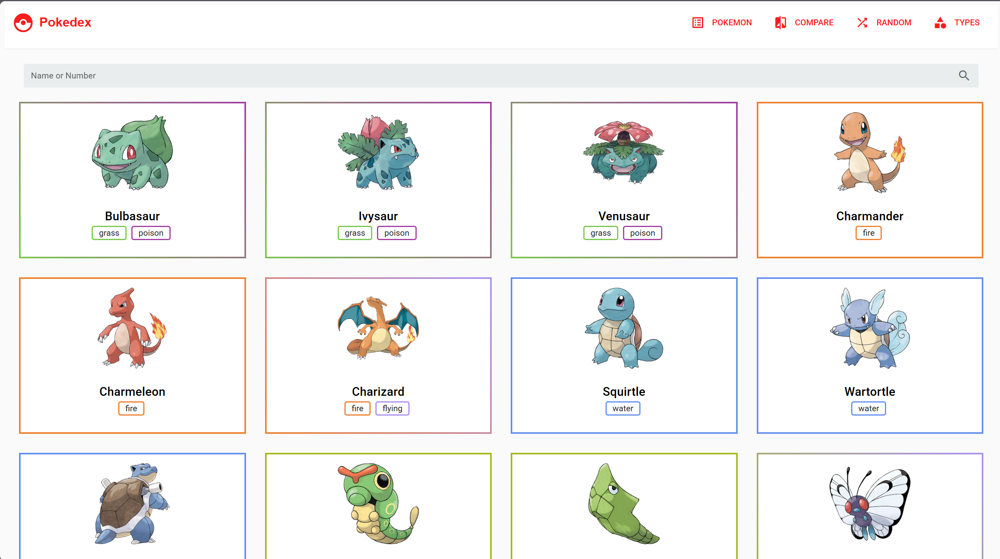
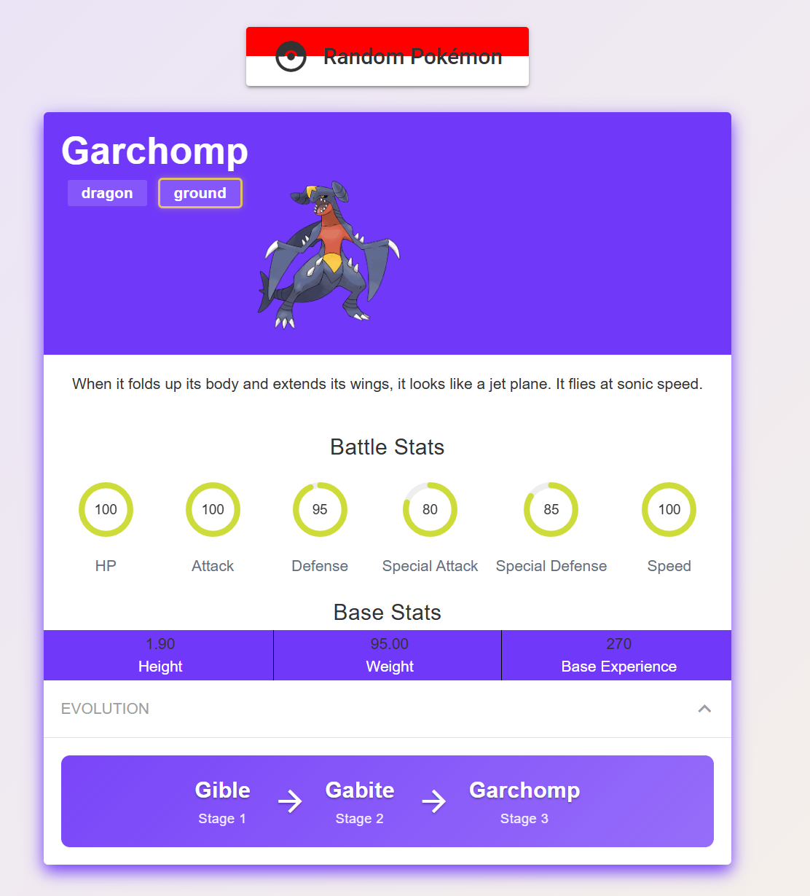
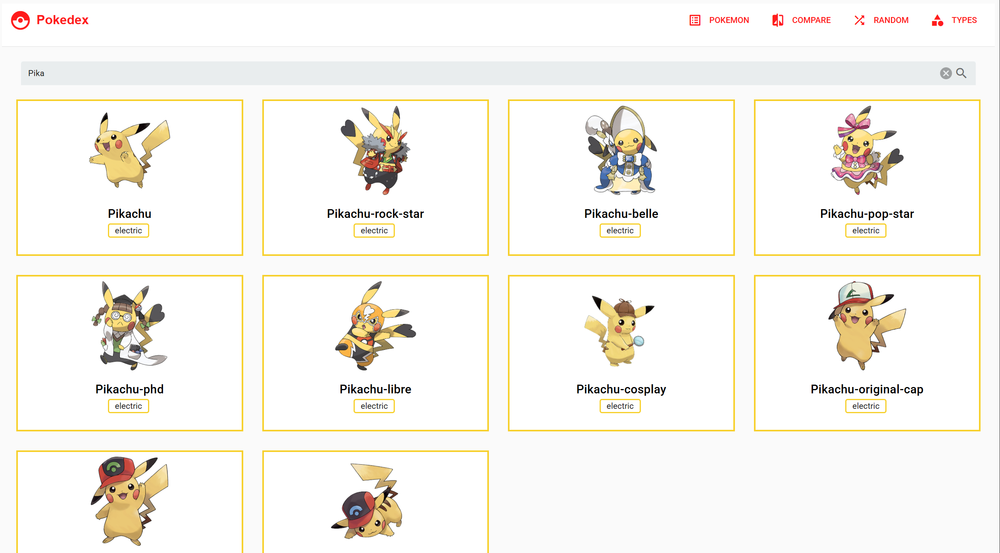
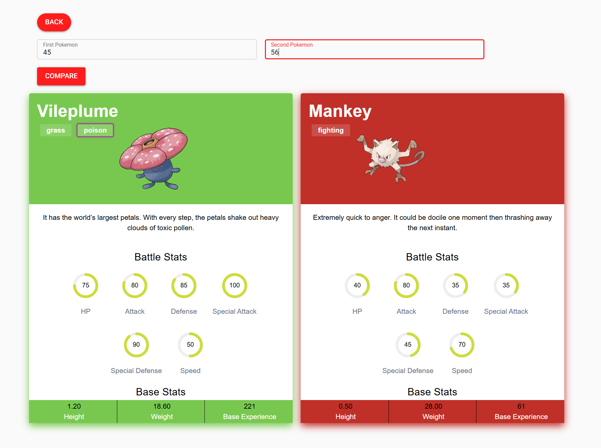
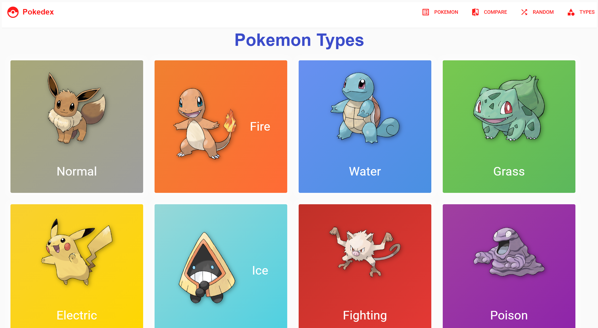
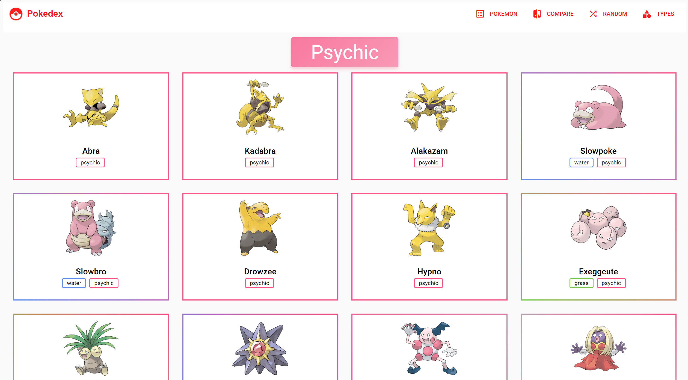
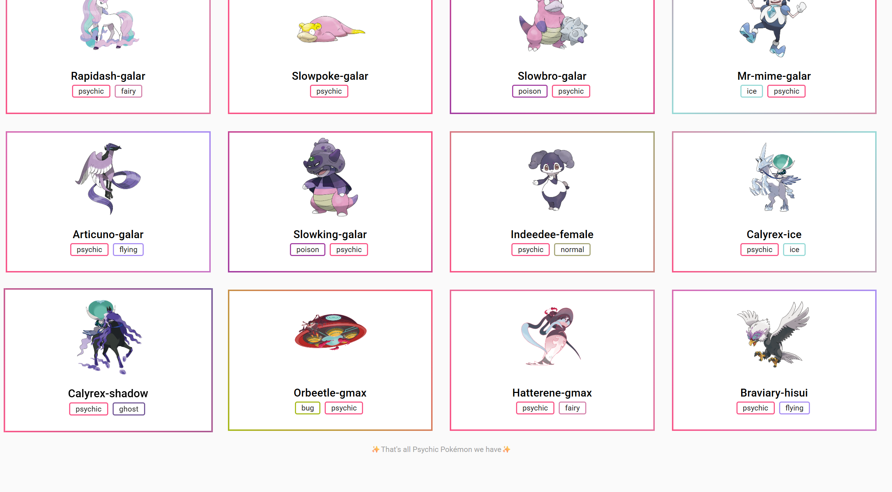
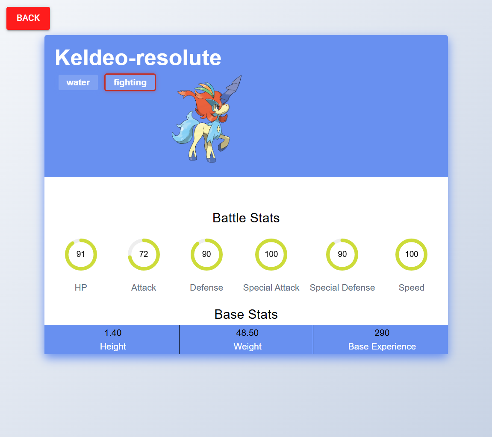

# Pokédex App

A full-stack Pokédex web app built with **Laravel**, **Vue.js**, and **Quasar**, using the [PokéAPI](https://pokeapi.co/) to fetch detailed Pokémon data.

---

### 🛠️ Tech Stack

- **Frontend:** Vue.js + Quasar Framework
- **Backend:** Laravel (RESTful API)
- **Data Source:** PokéAPI

---

### 🚀 Main Laravel Features Used

- RESTful API Architecture
- Eloquent Relationships & Models (Pokémon, Types, Evolutions)
- Dynamic Query Filters
- Database Seeding from PokéAPI (using Artisan commands)
- Custom Endpoints for:

  - Pokémon search
  - Type filtering
  - Evolution chain
  - Compare Pokemon
  - Randome Pokemon
  - Evolutio


---

### 🎨 Main Vue.js / Quasar Features Used

- **Vue Options API** for component logic
- **Quasar UI Components** for sleek, responsive design
- Vue Router for dynamic page routing
- Axios for API communication
- Custom reusable components (Pokémon Card, Compare, Type Filter, etc.)
- Expandable for evolution chains
- Search, compare, and filter Pokémon by type, name, etc.

---

### 🧠 Design Decisions

- **Minimal & clean UI** with soft gradients and shadows for better UX.
- **Separation of concerns:** Laravel handles all API/data processing, Vue handles presentation.
- **Reusable components** for scalability.
- **Efficient loading** using prefectching, lazy loading, browser caching for remoted resources.
- Responsive and mobile-friendly by default using Quasar utilities.

---

## 📸 Screenshots

### Home Page



### Random Pokémon



### Search Results



### Compare Pokémon



### Types Overview



### Pokémon of a Specific Type (with Infinite Scroll)




### Pokémon Without Evolution



Some Pokemons have no evolution details, so the evolution button uses dynamic rendering.

---

### 🤓 Want to Clone This Project?

#### Requirements

- [XAMPP](https://www.apachefriends.org/index.html) (or any LAMP stack)
- [Composer](https://getcomposer.org/)
- [Node.js & npm](https://nodejs.org/)
- Laravel CLI
- Quasar CLI (`npm install -g @quasar/cli`)

---

### 🧩 Installation Steps

1. **Clone this repo**

   ```
   git clone https://github.com/IshaHarmalkar/Pokedex.git
   cd pokedex-app
   ```

2. **Start Apache and MySQL** using XAMPP (or your preferred environment).

3. **Set up environment variables**

   - Copy `.env.example` to `.env`
   - Update DB credentials to match your MySQL setup

4. **Create a database named `pokemon`** in MySQL

5. **Install dependencies & run migrations**

   ```
   composer install
   php artisan migrate
   ```

6. **Run the seeders to fetch Pokémon data**

   ```
   php artisan db:seed
   ```

7. **Start the Laravel development server**

   ```
   php artisan serve
   ```

8. **Install frontend dependencies & run Quasar**

   ```
   cd frontend
   npm install
   quasar dev
   ```

9. 🎉 **You're all set!** Welcome to the Pokédex — happy exploring! 🐾

---

